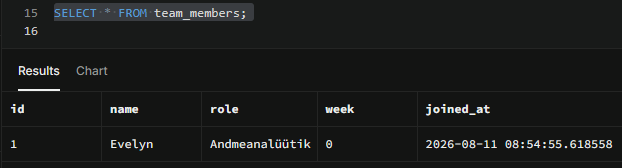

# Team Members SQL Project

## Projekti eesmärk

Selle ülesande eesmärk oli õppida SQL-i abil tabelit looma, andmeid lisama ja tabeli sisu kuvama.

## Kasutatud tööriistad

- Supabase
- PostgreSQL
- SQL

## Mida ma tegin?

- Lõin tabeli `team_members`.
- Lisasin tabelisse enda nime, rolli ja kursuse nädala.
- Kasutasin automaatselt tekkivat ID-numbrit ja kuupäeva.
- Kuvasin salvestatud andmed käsuga `SELECT`.

## Mida õppisin?

Õppisin kasutama järgmisi SQL-käske ja määranguid:

- `CREATE TABLE`
- `INSERT INTO`
- `SELECT`
- `PRIMARY KEY`
- `NOT NULL`
- `DEFAULT`
- `NOW()`

## Tulemus

Alloleval ekraanipildil on näha Supabase’is loodud tabel ja sellesse lisatud andmed.

