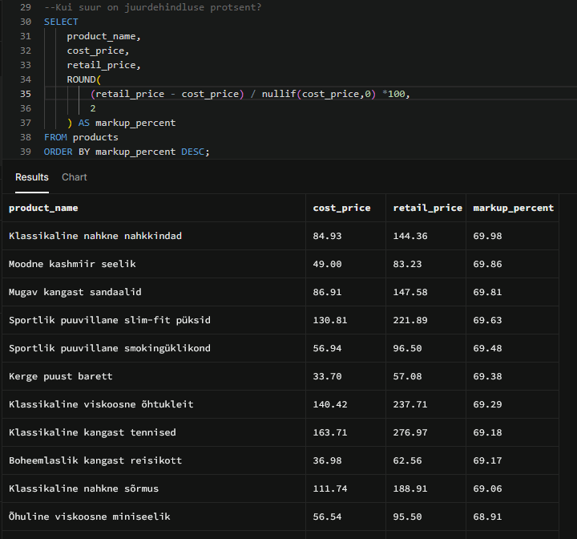
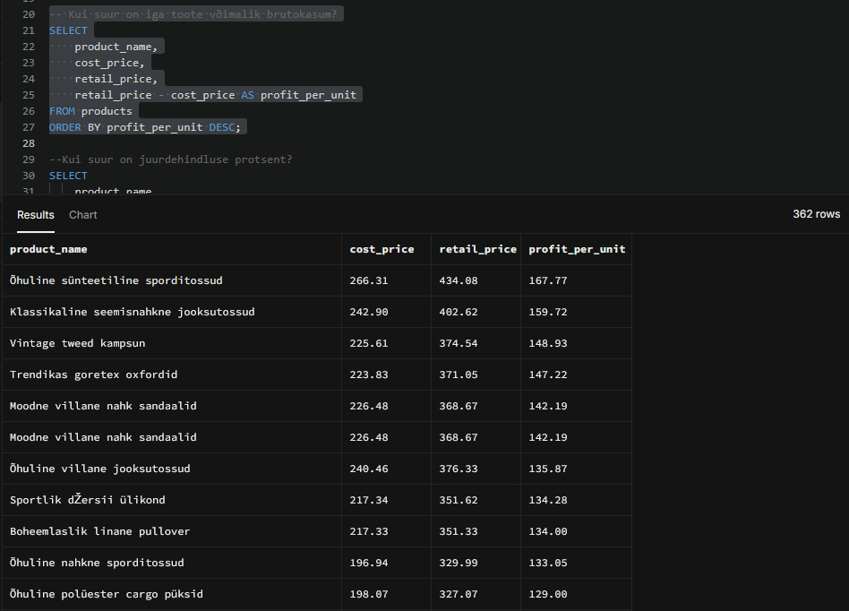
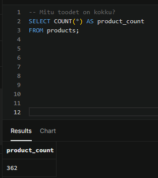
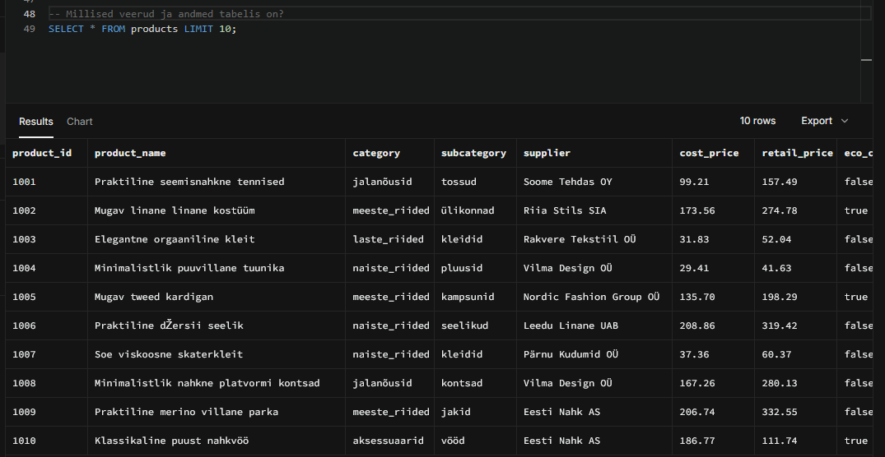
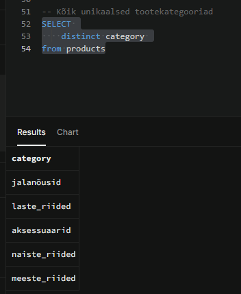
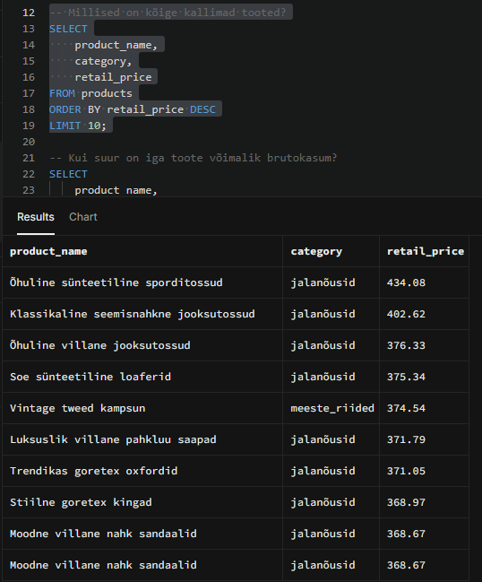
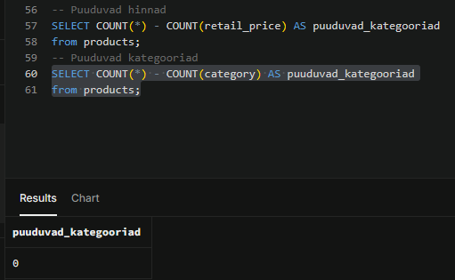

# Week 1 – SQL põhitõed

## Eesmärk

Selle artefakti eesmärk oli õppida SQL-i põhilisi käske ja kasutada neid `products` tabelis olevate andmete uurimiseks. Päringud koostasin ja käivitasin Supabase’i PostgreSQL-andmebaasis.

## Andmestik

Kasutasin `products` tabelit, mis sisaldab järgmisi veerge:

- `product_id`
- `product_name`
- `category`
- `subcategory`
- `supplier`
- `cost_price`
- `retail_price`
- `eco_certified`
- `created_at`

## Tehtud töö

Töö käigus harjutasin:

- vajalike veergude valimist käsuga `SELECT`;
- andmete filtreerimist käsuga `WHERE`;
- tulemuste sorteerimist käsuga `ORDER BY`;
- tulemuste arvu piiramist käsuga `LIMIT`;
- unikaalsete väärtuste leidmist käsuga `DISTINCT`;
- tabelis olevate ridade loendamist funktsiooniga `COUNT()`;
- arvutuste tegemist päringu sees;
- puuduvate ehk `NULL`-väärtuste kontrollimist.

## SQL-fail

Kõik kasutatud päringud asuvad failis:

- [week_1_sql_basics.sql](week_1_sql_basics.sql)

## Päringute tulemused

### Tulemuste sorteerimine kahanevas järjekorras

### Arvutatud väärtuse järgi sorteerimine

### Ridade arvu leidmine

### Tulemuste arvu piiramine

### Unikaalsete väärtuste leidmine

### Andmete filtreerimine

### NULL-väärtuste kontrollimine

## Mida õppisin?

Õppisin SQL-päringute abil andmebaasist vajalikku teavet leidma ning tulemusi filtreerima, sorteerima ja piirama. Sain harjutada ka unikaalsete väärtuste leidmist, ridade loendamist ja puuduvate väärtuste kontrollimist.

Samuti õppisin, et SQL-päring ei ole ainult tehniline käsk: enne päringu koostamist tuleb mõelda, millisele küsimusele soovin andmetest vastust saada.