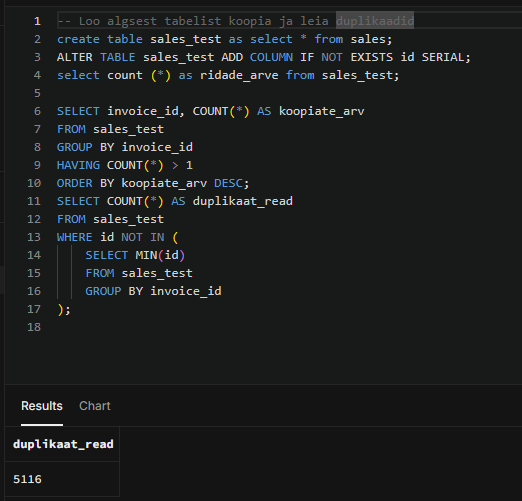
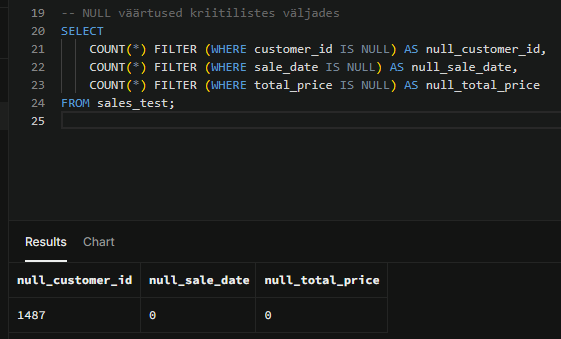
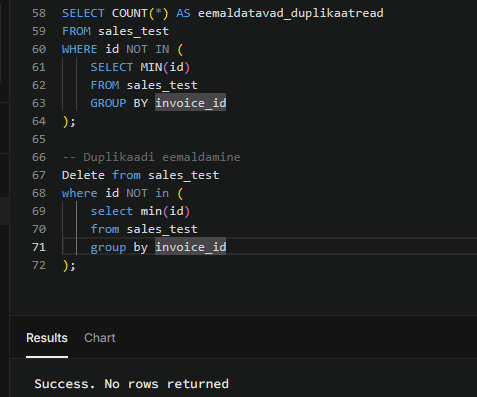
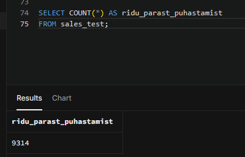
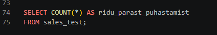

# Week 2 – SQL-andmete puhastamine

## Eesmärk

Selle artefakti eesmärk oli kontrollida `sales` tabeli andmekvaliteeti ning leida duplikaadid, puuduvad väärtused ja vigased kuupäevad. Algandmete säilitamiseks lõin puhastamiseks eraldi `sales_test` tabeli.

Analüüsi ja puhastamise tegin Supabase’i PostgreSQL-andmebaasis.

## Kasutatud tabel

Puhastamiseks lõin `sales` tabelist koopia:

```sql
CREATE TABLE sales_test AS
SELECT *
FROM sales;
```

Lisaks lõin tehnilise `id` veeru, mille abil sai duplikaatide eemaldamisel säilitada iga arvenumbri esimese kirje.

```sql
ALTER TABLE sales_test
ADD COLUMN IF NOT EXISTS id SERIAL;
```

## Andmekvaliteedi kontroll

Kontrollisin:

- korduvaid `invoice_id` väärtusi;
- puuduvaid `customer_id` väärtusi;
- puuduvaid `sale_date` väärtusi;
- puuduvaid `total_price` väärtusi;
- tulevikku jäävaid müügikuupäevi.

## Tulemused enne puhastamist

| Kontroll | Tulemus |
| --- | ---: |
| Eemaldatavaid duplikaatridu | 5116 |
| Puuduv `customer_id` | 1487 |
| Puuduv `sale_date` | 0 |
| Puuduv `total_price` | 0 |





## Tehtud muudatused

Duplikaatide eemaldamisel säilitasin iga `invoice_id` esimese kirje ehk kõige väiksema tehnilise `id` väärtusega rea. Ülejäänud sama arvenumbriga kirjed eemaldasin tabelist `sales_test`.

```sql
DELETE FROM sales_test
WHERE id NOT IN (
    SELECT MIN(id)
    FROM sales_test
    GROUP BY invoice_id
);
```

Puuduva `customer_id` väärtusega ridu ei eemaldanud, sest müügitehing võib olla korrektne ka siis, kui klienti pole võimalik tuvastada. Usaldusväärse kliendiinfo puudumisel ei asendanud ma väärtusi oletuslike andmetega.



## Tulemus pärast puhastamist

Pärast duplikaatide eemaldamist jäi `sales_test` tabelisse **9314 rida**.



Duplikaatide järelkontroll ei tagastanud ühtegi rida. See kinnitab, et korduvad `invoice_id` väärtused eemaldati.



## Kasutatud SQL-i võtted

- `CREATE TABLE AS SELECT` – testkoopia loomiseks;
- `ALTER TABLE` – tehnilise identifikaatori lisamiseks;
- `COUNT()` – kirjete loendamiseks;
- `FILTER` – erinevate `NULL`-väärtuste kontrollimiseks;
- `GROUP BY` ja `HAVING` – duplikaatide leidmiseks;
- `MIN()` – säilitatava kirje valimiseks;
- `DELETE` – korduvate kirjete eemaldamiseks;
- `IS NULL` – puuduvate väärtuste kontrollimiseks;
- alampäringud – eemaldatavate ridade määramiseks.

## Peamised tähelepanekud

- Andmestikus oli 5116 eemaldatavat duplikaatrida.
- Pärast puhastamist jäi alles 9314 müügikirjet.
- Müügikuupäev ja koguhind olid kõigil kontrollitud ridadel olemas.
- `customer_id` puudus 1487 real.
- Puuduva klienditunnusega read säilitati, et vältida müügiandmete põhjendamatut kaotamist.
- Algne `sales` tabel jäi muutmata.

## Failid

- [`data-cleaning.sql`](data-cleaning.sql) – kontrollimise ja puhastamise SQL-kood;
- `01-duplicate-check.png` – duplikaatide kontroll;
- `02-null-check.png` – puuduvate väärtuste kontroll;
- `03-duplicate-removal.png` – duplikaatide eemaldamine;
- `04-cleaned-row-count.png` – ridade arv pärast puhastamist;
- `05-duplicate-verification.png` – lõplik duplikaatide kontroll.

## Kokkuvõte

Ülesande käigus lõin algandmetest testkoopia, kontrollisin andmekvaliteeti ja eemaldasin korduvad kirjed. Puhastatud `sales_test` tabelisse jäi 9314 müügikirjet ning tabel sobib edasiseks analüüsiks.