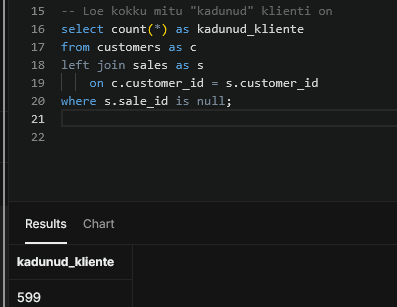
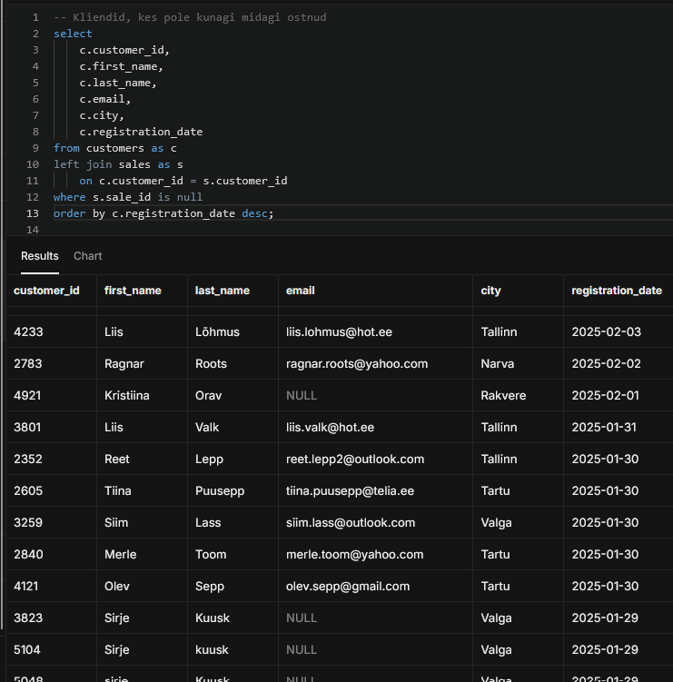
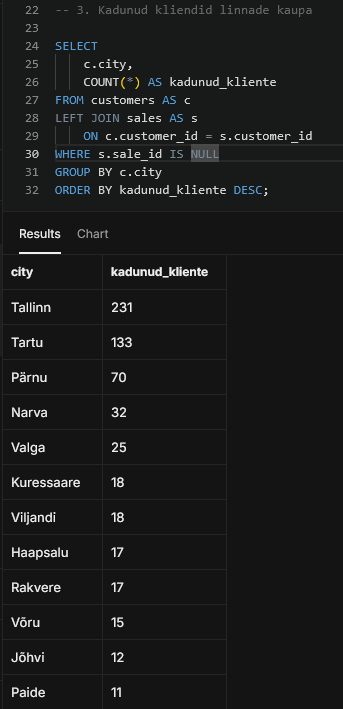
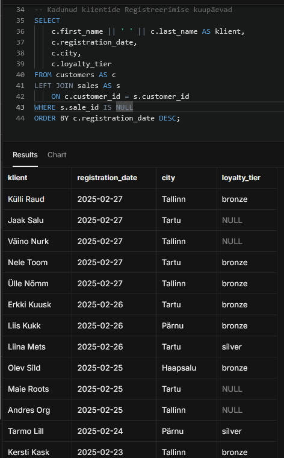
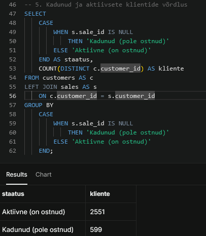
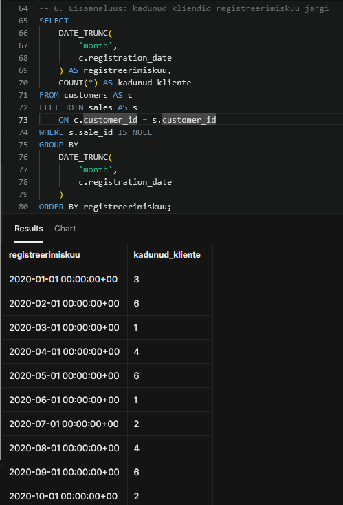

# Week 3 – SQL JOIN-id ja kadunud klientide analüüs

## Eesmärk

Selle töö eesmärk oli õppida SQL-i `JOIN`-lausete abil erinevaid andmetabeleid ühendama. Analüüsisin tabelite `customers` ja `sales` põhjal kliente, kes on UrbanStyle’is registreerunud, kuid pole teinud ühtegi ostu.

Analüüsi tegin Supabase’i PostgreSQL-andmebaasis. Töö valmis minu individuaalse panusena UrbanStyle’i grupiprojekti.

## Analüüsi küsimused

Soovisin välja selgitada:

- mitu klienti pole kunagi ostnud;
- kes need kliendid on;
- millistes linnades nad elavad;
- millal nad registreerusid;
- kui palju on aktiivseid ja ostuta kliente;
- kuidas võiks turundus neid esimese ostuni suunata.

## Kasutatud tabelid

Analüüsis ühendasin kaks tabelit:

- `customers` – klientide andmed;
- `sales` – müügitehingute andmed.

Tabelid ühendasin veeru `customer_id` kaudu.

## Kadunud klientide leidmine

Kasutasin `LEFT JOIN` ühendust, et säilitada kõik kliendid, sealhulgas need, kellele ei leitud `sales` tabelist ühtegi müügitehingut.

```sql
SELECT COUNT(*) AS kadunud_kliente
FROM customers AS c
LEFT JOIN sales AS s
    ON c.customer_id = s.customer_id
WHERE s.sale_id IS NULL;
```

Analüüsi tulemusel selgus, et **599 klienti pole kunagi ostnud**.



## Kadunud klientide nimekiri

Järgmise päringuga leidsin ostuta klientide nimed, kontaktandmed, linnad ja registreerumise kuupäevad.

```sql
SELECT
    c.customer_id,
    c.first_name,
    c.last_name,
    c.email,
    c.city,
    c.registration_date
FROM customers AS c
LEFT JOIN sales AS s
    ON c.customer_id = s.customer_id
WHERE s.sale_id IS NULL;
```



## Kadunud kliendid linnade kaupa

Rühmitasin ostuta kliendid linnade järgi, et leida piirkonnad, kus on kõige rohkem registreerunud, kuid ostuni mitte jõudnud kliente.

Kõige rohkem ostuta kliente oli järgmistes linnades:

| Linn | Kadunud klientide arv |
| --- | ---: |
| Tallinn | 221 |
| Tartu | 133 |
| Pärnu | 70 |
| Narva | 32 |
| Valga | 25 |

Tulemused näitavad, et suurim võimalus klientide aktiveerimiseks asub Tallinnas ja Tartus.



## Registreerumise andmed

Analüüsisin ka seda, millal ostuta kliendid registreerusid. See võimaldab eristada hiljuti liitunud kliente nendest, kes on olnud kliendibaasis pikemat aega, kuid pole endiselt esimest ostu teinud.

Analüüsi lisasin kliendi nime, registreerumise kuupäeva, linna ja lojaalsustaseme.



## Klientide staatus

Jagasin kliendid ostukäitumise järgi kahte rühma:

- **aktiivne klient** – kliendil on vähemalt üks ost;
- **kadunud klient** – klient on registreerunud, kuid pole kordagi ostnud.

| Staatus | Klientide arv |
| --- | ---: |
| Aktiivne – on ostnud | 2551 |
| Kadunud – pole ostnud | 599 |
| Kokku | 3150 |

Ligikaudu **19% registreerunud klientidest** pole teinud ühtegi ostu.



## Registreerumised kuude kaupa

Koondasin ostuta kliendid registreerumise kuu järgi. See aitab välja selgitada, millistel perioodidel liitus rohkem kliente, kes ei jõudnud pärast registreerumist esimese ostuni.

Sellist tulemust saab kasutada varasemate kliendivärbamiskampaaniate hindamiseks ja uute kampaaniate ajastamiseks.



## Raport turundusjuhile Anna Metsale

UrbanStyle’i kliendibaasis on 599 registreerunud klienti, kes pole veel ühtegi ostu teinud. Kõige rohkem selliseid kliente asub Tallinnas ja Tartus, mistõttu võiks esimese kampaania suunata just nende linnade klientidele. Registreerumise kuupäeva järgi saab eristada hiljuti liitunud ja pikemat aega passiivseid kliente ning saata neile erineva sõnumiga pakkumised. Esimese ostu soodustus või ajaliselt piiratud personaalne pakkumine võiks aidata muuta need kontaktid aktiivseteks klientideks.

## Soovitused

- suunata esimene aktiveerimiskampaania Tallinna ja Tartu klientidele;
- pakkuda ostuta klientidele esimese ostu soodustust;
- kasutada ajaliselt piiratud pakkumist, mis motiveerib kiiremini tegutsema;
- kohandada sõnumit kliendi registreerumisaja järgi;
- jälgida pärast kampaaniat, kui paljud ostuta kliendid tegid esimese ostu.

## Harjutatud oskused

- tabelite ühendamine käsuga `LEFT JOIN`;
- tabelialiaste kasutamine;
- tabelite sidumine veeru `customer_id` kaudu;
- ostuta klientide leidmine tingimusega `IS NULL`;
- tulemuste rühmitamine käsuga `GROUP BY`;
- tulemuste sorteerimine käsuga `ORDER BY`;
- kliendistaatuse määramine käsuga `CASE`;
- kuupäevade koondamine perioodide kaupa;
- tehniliste tulemuste muutmine praktilisteks ärisoovitusteks.

## Failid

- [`sql_formulas_week3.sql`](sql_formulas_week3.sql) – analüüsimiseks kasutatud SQL-päringud;
- `01-lost-customers-count.png` – ostuta klientide arv;
- `02-lost-customers-list.png` – ostuta klientide nimekiri;
- `03-lost-customers-by-city.png` – tulemused linnade kaupa;
- `04-lost-customers-registration-details.png` – registreerumise andmed;
- `05-customer-status-summary.png` – aktiivsete ja ostuta klientide võrdlus;
- `06-lost-customers-by-registration-month.png` – tulemused registreerumiskuu järgi.

## Kokkuvõte

SQL-i `LEFT JOIN` ühenduse abil leidsin kliendid, kellel puudus vastav müügikirje. Analüüs näitas, et 3150 registreerunud kliendist 599 pole veel ühtegi ostu teinud. Kõige rohkem ostuta kliente asub Tallinnas ja Tartus. Tulemusi saab kasutada sihitud turunduskampaaniate koostamiseks ja registreerunud klientide esimese ostuni suunamiseks.
