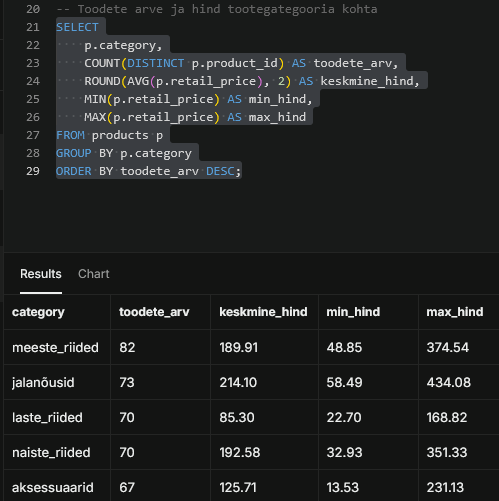
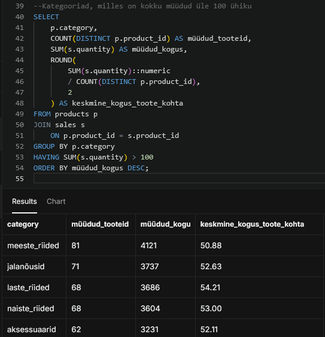
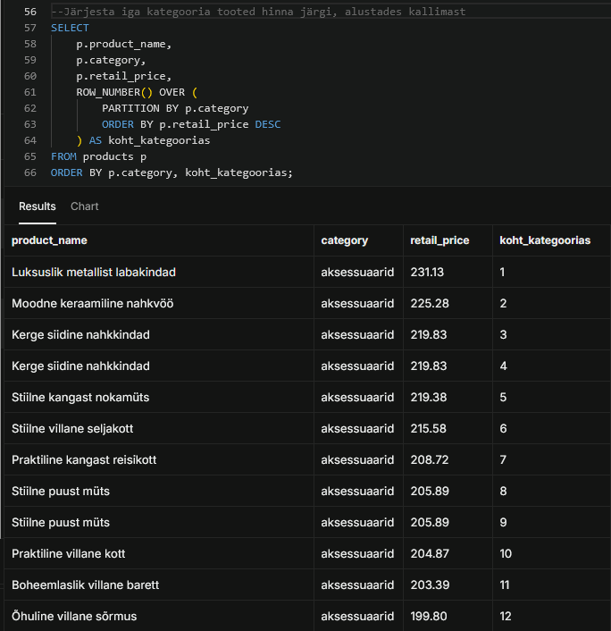
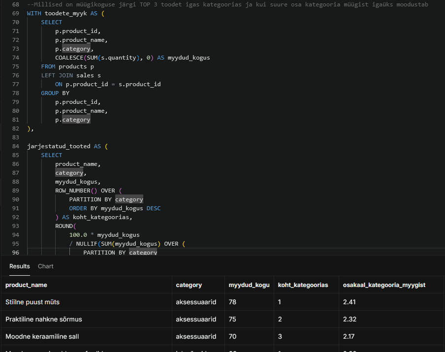

# Week 4 – Inventuuristatistika

## Ülesande eesmärk

Selle analüüsi eesmärk oli uurida UrbanStyle’i tootekategooriaid, toodete hindu ja müügikoguseid. Analüüsis kasutasin `GROUP BY`, `HAVING`, tabelite ühendamist ja window function’e. Lisaks järjestasin tooted kategooriate sees ning leidsin iga kategooria kolm enim müüdud toodet.

## Kasutatud tabelid

- `products` – toodete nimed, kategooriad ja hinnad
- `sales` – müügitehingud ja müüdud kogused
- `inventory_movements` – laoliikumiste info

Tabelid `products` ja `sales` ühendati veeru `product_id` kaudu.

## 1. Tootekategooriate koondandmed

Esimese päringuga arvutasin iga kategooria kohta:

- erinevate toodete arvu;
- toodete keskmise jaehinna;
- kõige madalama jaehinna;
- kõige kõrgema jaehinna.

Päringus kasutasin kategooriate moodustamiseks `GROUP BY` käsku. Erinevate toodete loendamiseks kasutasin `COUNT(DISTINCT product_id)`, et sama toodet ei loendataks mitu korda.

### Tulemused

| Kategooria | Toodete arv | Keskmine hind | Minimaalne hind | Maksimaalne hind |
|---|---:|---:|---:|---:|
| meeste_riided | 82 | 189.01 | 48.85 | 374.54 |
| jalanõusid | 73 | 214.10 | 58.49 | 434.08 |
| laste_riided | 70 | 85.30 | 32.70 | 188.02 |
| naiste_riided | 70 | 192.58 | 32.93 | 351.33 |
| aksessuaarid | 67 | 125.71 | 13.53 | 263.19 |

Kõige rohkem erinevaid tooteid oli meeste riiete kategoorias. Kõige kõrgem keskmine jaehind oli jalanõudel ning kõige madalam laste riietel.

## 2. Kategooriate müügianalüüs

Teise päringuga ühendasin `products` ja `sales` tabelid. Arvutasin iga kategooria müüdud koguse, müüdud erinevate toodete arvu ja keskmise müüdud koguse ühe toote kohta.

Päringus kasutasin `HAVING` tingimust, et kuvada ainult kategooriad, mille müüdud kogus oli suurem kui 100 ühikut. Erinevalt `WHERE` tingimusest kasutatakse `HAVING`-ut pärast ridade grupeerimist arvutatud tulemuste filtreerimiseks.

### Tulemused

| Kategooria | Müüdud erinevaid tooteid | Müüdud kogus | Keskmine kogus toote kohta |
|---|---:|---:|---:|
| meeste_riided | 81 | 4121 | 50.88 |
| laste_riided | 60 | 3860 | 64.33 |
| jalanõusid | 71 | 3737 | 52.63 |
| naiste_riided | 68 | 3604 | 53.00 |
| aksessuaarid | 62 | 3231 | 52.11 |

Kõige suurem müügimaht oli meeste riietel: kokku müüdi 4121 ühikut. Laste riiete kategoorias müüdi vähem erinevaid tooteid, kuid keskmine müüdud kogus ühe toote kohta oli kõige suurem.

## 3. Toodete järjestamine kategooria sees

Kolmanda päringuga järjestasin tooted jaehinna järgi oma kategooria sees. Selleks kasutasin `ROW_NUMBER()` window function’it.

`PARTITION BY category` alustab igas kategoorias järjestamist uuesti numbrist 1. `ORDER BY retail_price DESC` paigutab kategooria kõige kallima toote esimesele kohale.

## 4. TOP 3 tooted kategooria sees

Lisaülesandes arvutasin kõigepealt iga toote müüdud koguse. Seejärel järjestasin tooted müügikoguse järgi oma kategooria sees ja jätsin igast kategooriast alles kolm enim müüdud toodet.

Müügita toodete säilitamiseks kasutasin `LEFT JOIN`-i. Funktsioon `COALESCE` asendas puuduva müügikoguse nulliga. Lisaks arvutasin, kui suure protsendi moodustas iga TOP 3 toote müük vastava kategooria kogumüügist.

## Kokkuvõte ja soovitused

Müügimahu põhjal on kõige tugevam kategooria meeste riided, millest müüdi kokku 4121 ühikut, samas kui jalanõudel on kõige kõrgem keskmine jaehind. Laste riiete kategoorias on kõige suurem keskmine müük ühe müüdud toote kohta, mistõttu tasub kontrollida, kas populaarsemate toodete laovaru on piisav. Kõige väiksem kogumüük oli aksessuaaridel, seega võiks Anna analüüsida selle kategooria nõrgema müügiga tooteid ning katsetada komplektipakkumisi koos riiete või jalanõudega. Tegeliku kasumlikkuse hindamiseks tuleks võrrelda müügitulu ka toodete omahinna ja laoseisuga, sest ainult müüdud kogus ei näita veel kasumit.

## Kasutatud SQL-võtted

- `GROUP BY`
- `HAVING`
- `COUNT(DISTINCT ...)`
- `SUM`, `AVG`, `MIN` ja `MAX`
- `JOIN` ja `LEFT JOIN`
- `COALESCE`
- `ROW_NUMBER()`
- `PARTITION BY`
- Common Table Expressions ehk `WITH`-päringud

## Failid

- `week4_inventory_aggregation.sql` – analüüsis kasutatud SQL-päringud
- `01_category_summary.png` – tootekategooriate koondandmed
- `02_category_sales.png` – kategooriate müügianalüüs
- `03_price_ranking.png` – toodete hinnajärjestus kategooriate sees
- `05_top3_products.png` – iga kategooria TOP 3 toodet