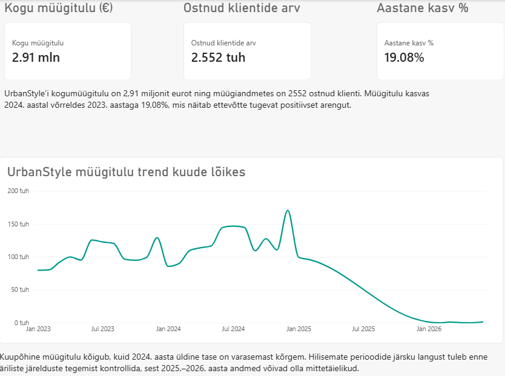
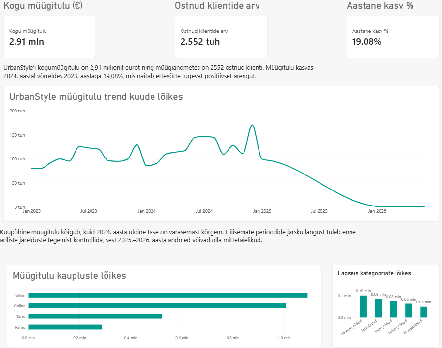
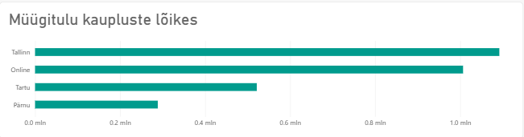
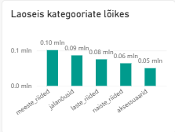
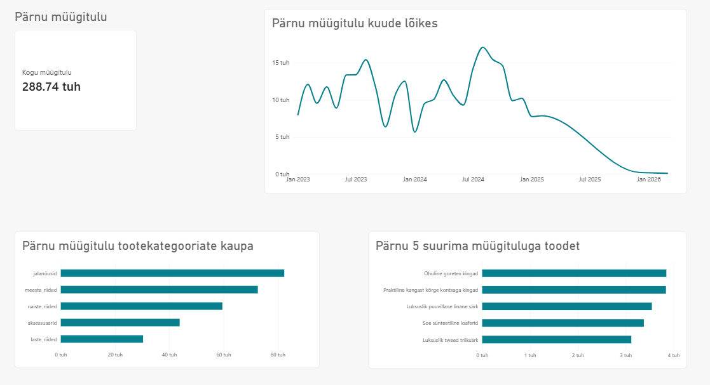
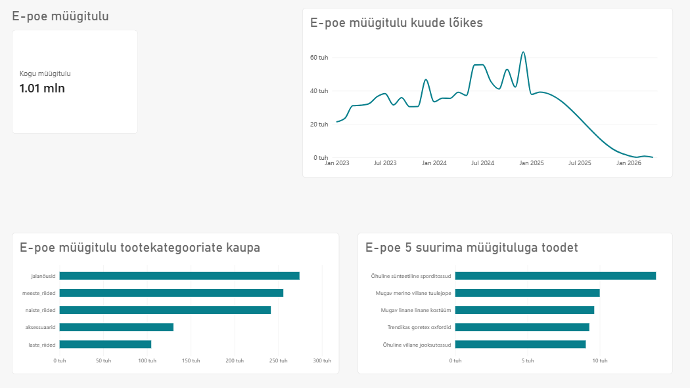

# Nädalad 5–6 – UrbanStyle'i dashboard'id ja andmelood

**Autor:** Evelyn Uusmaa  
**Tööriist:** Power BI  
**Grupiprojekt:** [UrbanStyle Sales Analytics](https://github.com/andres-assukyll/urbanstyle-sales-analytics)

## Projekti eesmärk

UrbanStyle'il on kolm füüsilist kauplust ja e-pood. 5. nädalal koostasin tegevjuhile kogu ettevõtte tulemusi koondava dashboard'i. 6. nädalal jätkasin analüüsi Pärnu kaupluse ja e-poe eraldi vaadetega ning kirjutasin nende põhjal andmelood. Nii liikus töö üldpildist konkreetsete müügikohtade tulemuste ja tegevussoovitusteni.

## 5. nädal – CEO dashboard

Minu ülesanne oli koostada tegevjuht Kristi Tammele ülevaade peamistest tulemusnäitajatest, müügi muutumisest ajas ning kaupluste erinevustest.

### Täiendavad vaated

**Peamised tulemusnäitajad**

**Müük kaupluste lõikes**

**Laoseis tootekategooriate lõikes**

CEO vaade koondab tulemused ühte kohta, et juht saaks võrrelda müüki ajas ja kaupluste lõikes. Laoseisu vaade aitab märgata erinevusi tootekategooriate vahel. Ajatelje lõpus nähtavat langust tuleb hinnata pärast viimaste kuude andmete täielikkuse kontrollimist.

## 6. nädal – Pärnu kauplus ja e-pood

Grupitöö rollijaotuse järgi koostasin Pärnu kaupluse ja e-poe vaated. Pärnu puhul uurisin võimalikku hooajalisust; e-poe puhul müügitrendi ja digitaalse kanali tulemusi. Mõlema vaate eesmärk oli sõnastada nähtav muster, selle äriline tähendus ning soovitus turundusjuht Anna Metsale.

### Pärnu kauplus

Pärnu kaupluse kogumüügitulu on **288,74 tuhat eurot**. Kõrgeim nähtav kuukäive jääb 2024. aasta teise poolde ja ulatub ligikaudu 17 tuhande euroni. Jalatsid on suurima müügituluga tootekategooria. Graafikul leidub tugevamaid ja nõrgemaid kuid ka väljaspool üht kindlat hooaega, mistõttu ei saa ainult selle pildi põhjal väita, et müüki juhib suvine turismihooaeg.

**Soovitus:** võrrelda samade kuude tulemusi eri aastatel ja planeerida tugevamate müügiperioodide eel jalatsite varu. Viimaste kuude andmete täielikkus tuleb enne languse tõlgendamist kontrollida.

### E-pood (Online)

E-poe kogumüügitulu on **1,01 miljonit eurot**. Kõrgeim nähtav kuukäive ületab 2024. aasta lõpus ligikaudu 60 tuhat eurot. Jalatsid toovad ka e-poes tootekategooriatest suurima müügitulu. Hilisema languse põhjust ei saa ainult dashboard'i põhjal kindlaks teha.

**Soovitus:** uurida kõrge müügiga kuude tooteid ja võimalikke kampaaniaid ning võrrelda müügitulu kasumi ja laoseisuga. Enne kasvumäära või languse hindamist tuleb kontrollida viimaste perioodide andmete täielikkust.

## Mida õppisin?

- Koostasin üldise juhtimisvaate ning täiendasin seda kahe müügikoha eraldi analüüsiga.
- Harjutasin Power BI graafikutest äriliselt oluliste leidude väljatoomist.
- Õppisin eristama graafikul nähtavat tulemust selle võimalikust, kuid kontrollimata põhjusest.
- Märkasin, kuidas puudulikud andmed ajatelje lõpus võivad jätta eksitava mulje müügilangusest.

## AI kasutamine

Kasutasin ChatGPT-d dashboard'ide ülesehituse ja andmelugude sõnastamise abivahendina. Kontrollisin väiteid oma Power BI vaadete järgi ega esitanud oletatavaid müügimuutuste põhjuseid kinnitatud faktidena.