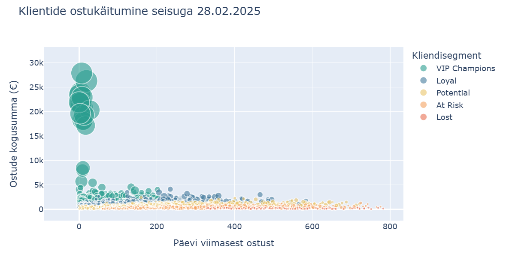
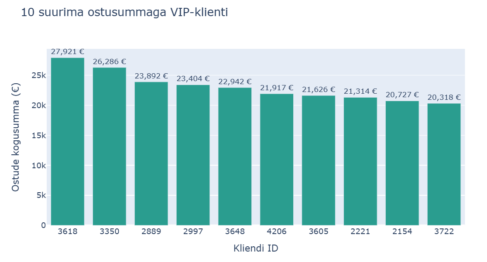

# Nädal 7 – RFM-kliendianalüüs Pythoniga

## Eesmärk

Analüüsisin UrbanStyle’i õppeandmete põhjal klientide ostukäitumist.
Eesmärk oli leida väärtuslikud kliendid, kordusostude kasvupotentsiaal
ja tähelepanu vajavad kliendirühmad ning koostada soovitused Markole.

## Minu panus

Läbisin iseseisvalt kõik tööetapid:
- müügi- ja kliendiandmete laadimine ning ühendamine;
- andmete puhastamine ja analüüsiperioodi piiramine;
- RFM-näitajate ja skooride arvutamine;
- klientide jagamine viide segmenti;
- kolme graafiku koostamine;
- tulemuste tõlgendamine ja äriliste soovituste sõnastamine.

Lisasin koodilahtritesse eestikeelsed kommentaarid, et selgitada
iga sammu eesmärki ja kasutatud meetodeid.

**Töövahendid:** Python, pandas, Jupyter Notebook, Plotly ja VS Code.

## Failid

- [Jupyteri märkmik koos koodikommentaaridega](week7_rfm_complete.ipynb)
- [Klientide jaotus segmentides](rfm.png)
- [Klientide ostukäitumine](ostukäitumine.png)
- [Kümme suurima ostusummaga VIP-klienti](VIP.png)

## Andmete ettevalmistamine

Lähteandmetes oli 15 234 müügikirjet ja 3150 klienti.
Ühendasin müügi- ja klienditabeli kliendi ID järgi LEFT JOIN meetodiga.

| Etapp | Eemaldatud kirjeid | Alles müügikirjeid |
|---|---:|---:|
| Lähteandmed | – | 15 234 |
| Korduvate arvete eemaldamine | 5116 | 10 118 |
| Puuduva kliendi ID-ga kirjete eemaldamine | 988 | 9130 |
| Analüüsiperioodi piiramine | 28 | 9102 |
| Negatiivse summaga kirjete eemaldamine | 179 | 8923 |

Analüüsi kaasasin ostud kuni **28.02.2025**, et hilisem mitteaktiivne
periood tulemusi ei mõjutaks. Nullsummaga müügikirjeid ei olnud.

Klienditabelis ei olnud korduvaid kliendi ID-sid.
E-post puudus 380 ja lojaalsustase 1260 kliendil.
Need väljad ei olnud RFM-arvutusteks vajalikud.

## RFM-meetod

RFM kirjeldab klienti kolme ostukäitumise näitaja abil.

| Näitaja | Mida arvutasin? | Kõrgema skoori tingimus |
|---|---|---|
| Recency | Päevad viimasest ostust seisuga 28.02.2025 | Hiljutisem ost |
| Frequency | Erinevate arvete arv kliendi kohta | Rohkem oste |
| Monetary | Positiivsete ostude kogusumma kliendi kohta | Suurem ostusumma |

Kasutasin iga näitaja hindamiseks viit skoorirühma.
Recency puhul sai väiksem päevade arv kõrgema skoori.
Frequency ja Monetary puhul sai suurem väärtus kõrgema skoori.

Liitsin kolm skoori RFM-koguskooriks vahemikus 3–15.
Koguskoori järgi määrasin kliendi segmendi.

## Tulemused

RFM-tabelisse jäi **2540 ostnud klienti**.

| Segment | RFM-koguskoor | Klientide arv | Osakaal |
|---|---:|---:|---:|
| VIP Champions | 13–15 | 453 | 17,8% |
| Loyal | 10–12 | 678 | 26,7% |
| Potential | 7–9 | 768 | 30,2% |
| At Risk | 4–6 | 524 | 20,6% |
| Lost | 3 | 117 | 4,6% |
| **Kokku** | | **2540** | **100%** |

Segmentide osakaalude summa on ümardamise tõttu 99,9%.

### Klientide arv segmentide kaupa

Suurim segment oli **Potential**: 768 klienti ehk 30,2% analüüsitud
klientidest. VIP- ja lojaalseid kliente oli kokku 1131.
At Risk ja Lost segmentides oli kokku 641 klienti.

### Klientide ostukäitumine

Iga mull tähistab ühte klienti:
- horisontaaltelg näitab päevade arvu viimasest ostust;
- vertikaaltelg näitab ostude kogusummat;
- mulli suurus näitab ostude arvu;
- värv näitab kliendisegmenti.

Graafikul paiknevad suurimate ostusummadega kliendid hiljutiste
ostjate hulgas. Graafik aitab vaadelda ostude sagedust, kogusummat
ja viimase ostu vanust korraga.

### Kümme suurima ostusummaga VIP-klienti

Valisin VIP-segmendist kümme suurima ostusummaga klienti.
Nende ostude kogusummad jäid ligikaudu **20 318–27 921 euro** vahele.
Suurima ostusummaga klient oli **ID 3618**.

## Ärilised soovitused Markole

### Potentsiaalsed kliendid

Katsetada personaalset kordusostu pakkumist.
Mõõta 30 päeva jooksul uuesti ostnud klientide osakaalu ning
võrrelda tulemust pakkumist mitte saanud kontrollrühmaga.

### VIP- ja lojaalsed kliendid

Pakkuda personaalset teenindust ja varajast ligipääsu uutele
kollektsioonidele. Jälgida kordusostumäära ja ostusumma muutust.

### At Risk ja Lost kliendid

Katsetada tagasivõitmise kampaaniat.
Mõõta uuesti ostnud klientide osakaalu ning hinnata,
kas kampaania tulemus katab pakkumise kulud.

## Mida õppisin?

- Ühendama müügi- ja kliendiandmeid pandas merge-meetodiga.
- Kontrollima, et klienditabelis oleks iga kliendi ID unikaalne.
- Eemaldama korduvaid kirjeid ja kontrollima puuduvaid väärtusi.
- Otsustama, millised puuduvad väljad mõjutavad analüüsi.
- Teisendama kuupäevi ja piirama analüüsiperioodi.
- Kasutama groupby-meetodit kliendipõhiste näitajate arvutamiseks.
- Arvutama qcut-meetodiga RFM-skoore ja määrama segmente.
- Koostama Plotlyga tulpdiagramme ja mullgraafikut.
- Tõlgendama tulemusi ning sõnastama nende põhjal ärilisi soovitusi.

## Tulemuste piirangud

Analüüs kirjeldab olukorda seisuga **28.02.2025**.
Enne kampaaniate käivitamist tuleb segmendid ajakohaste
müügiandmetega uuesti arvutada.

Monetary sisaldab ainult positiivsete ostude kogusummat.
Negatiivsed kirjed eemaldasin vastavalt ülesandele.
Tagastusi ostusummast maha ei arvestatud, seega ei näita
Monetary netokäivet ega kasumit.

RFM-tabel hõlmab analüüsiperioodil positiivse ostuga kliente.
Ostudeta kliendid sellesse tabelisse ei kuulu.

At Risk ja Lost on skooripõhised kategooriad.
Need ei tõesta kliendi lõplikku lahkumist.

Frequency skoorimisel kasutasin rank(method="first") meetodit.
Sama ostude arvuga kliendid võivad seetõttu saada erineva skoori
ridade järjekorra järgi.

## Märkmiku käivitamine

Märkmik kasutab lähtefaile:
- sales2.csv
- customers.csv

Paiguta need märkmikuga samasse kausta.
Lähtefailid ei ole selle nädala portfooliofailide hulgas.

Vajalikud paketid: pandas, plotly ja nbformat.
Käivita märkmiku lahtrid ülevalt alla.

Salvestatud graafikuid saab vaadata README-s ka märkmikku käivitamata.

## AI kasutamine

Kasutasin ChatGPT-d koodi selgitamise, vigade lahendamise,
eestikeelsete kommentaaride lisamise ja kokkuvõtte koostamise abiks.
Koodi käivitasin ning tulemusi kontrollisin Jupyteris.